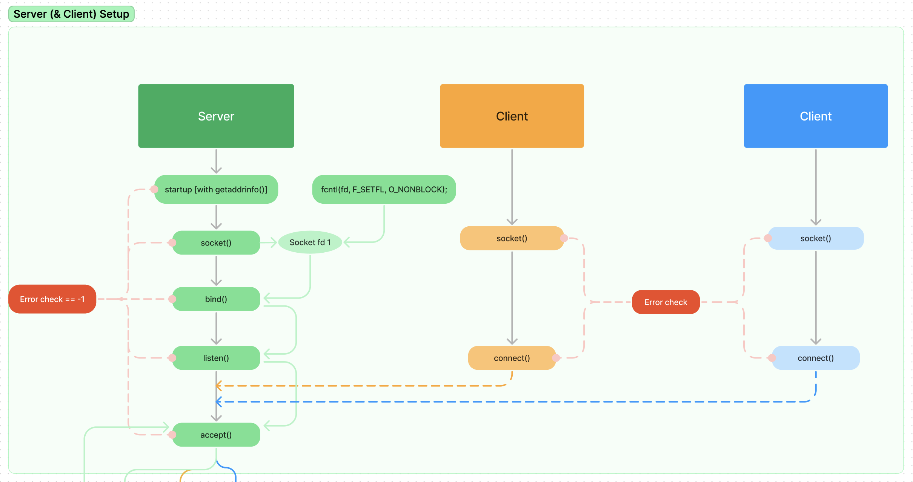

# ft_irc - Internet Relay Chat Server

*This project was developed as part of the School 42 curriculum in collaboration with [Dorian Jagusch](https://github.com/dorianjagusch).*
*Thank you for the collaboration and writing this readme Dorian! :-)*

## Overview

`ft_irc` is a project from School 42 that involves the creation of an IRC (Internet Relay Chat) server and client. IRC is a real-time text communication protocol, and this project offers an opportunity to gain expertise in network programming and communication protocols. As a reference client, we used [Irssi](https://irssi.org/New-users/). We recommend using it, too, when trying out the project.


## Description

The `ft_irc` project is a practical exercise in building an IRC server and client. It involves the following components:

- **Server**: The project aims to create a functional IRC server capable of handling multiple clients simultaneously. The server should manage user connections, channels, operators and chat messages.
- **Command Handling**: The server and client must handle IRC commands for communication, such as JOIN, PRIVMSG, and QUIT.
- **Channel Management**: Users can create, join, and manage channels for group communication.
- **Error Handling**: The project emphasizes robust error handling to ensure that the server and client can handle unexpected issues gracefully.

## Implementation

We implemented the following commands

  | Command  | Description                                    |
|----------|------------------------------------------------|
| JOIN     | Join a specific channel to participate in chat. |
| PART     | Leave a channel.                               |
| PRIVMSG  | Send a private message to a user or channel.   |
| NOTICE   | Send a notice to a user or channel.            |
| PASS     | Provide password to register with the server.  |
| NICK     | Change your nickname.                          |
| USER     | Set your username and realname.               |
| MODE     | Set the mode of a channel or user.            |
| KILL     | Disconnect a user from the server             |
| KICK     | Remove a user from a channel.                 |
| TOPIC    | Set the topic of a channel.                   |
| INVITE   | Invite a user to a channel                    |
| QUIT     | Disconnect from the IRC server.               |
| MOTD     | Display the message of the day.               |
| AWAY     | Set an away message.                          |
| PING     | Check server response.                         |
| PONG     | Respond to a PING request.                   |

### How it works

Here is a graphical representation of how the server works. An annotated version can be found [here](https://www.figma.com/file/qUbRWMAYafTy1LIMP9Jbtl/irc-jam?type=whiteboard&node-id=0%3A1&t=BbWNFXiyWJP4WV8v-1) 




## Learning

### Soft Skills

The successful completion of the `ft_irc` project required effective GitHub management and problem-solving skills. Utilizing git for collaboration on the code, task management, and progress tracking was crucial. Strong communication skills played a vital role in coordinating efforts for a smooth development process.

### Technical Skills

The implementation of `ft_irc` involved a variety of technical skills:

- **C++ Programming**: The entire project is implemented in the C++ programming language, following the Norm guidelines provided by School 42.
- **Network Programming**: Understanding network protocols, socket programming, and managing client-server communication.
- **Command Parsing**: Developing a parser to handle and interpret IRC commands.
- **User Authentication**: Implementing user authentication and access control to ensure the security of the chat system.
- **Error Handling**: Building mechanisms to handle errors gracefully, such as user disconnects and server failures.
- **Concurrent Programming**: Managing multiple client connections simultaneously on the server.

## Prerequisites

Before you start working on the `ft_irc` project, ensure that you have the following prerequisites:

- `gcc` (GNU Compiler Collection)
- `make`
- A compatible C library

Our repository should already contain any additional dependencies or libraries required for the project.

## Installation

1. Clone this repository to your local machine:

   ```bash
   git clone https://github.com/yourusername/ft_irc.git
   cd ft_irc
   ```

2. Compile the server and client components according to the project's build instructions.

3. Run the server and client applications to test the IRC system.

## Usage
To use the ft_irc project, follow these steps:

Start the IRC server by running the compiled server executable with appropriate settings.

  ```bash
  ./ircserv <port> <password>
  ```
Launch the IRC client application to connect to the server and interact with other users.

To connect with Irssi, install it (see above). Run it with:

```bash
 irssi
```

then 

```bash
/connect 127.0.0.1 <port> <password> [<nick>]
```

Use IRC commands to join channels, send messages, and engage in real-time communication with other users.

